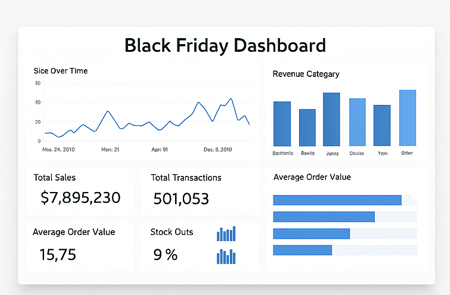
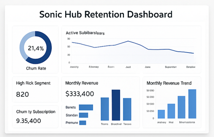
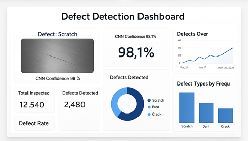

# 📊 Rishabh Gaur – Business Analytics Portfolio

Welcome to my business analytics project portfolio! This repository features 3 end-to-end projects across Retail, Media, and Manufacturing domains. Each project is designed to solve real business problems using data, analytics, and automation.

🚀 **Why This Portfolio Matters:**  
In today’s data-driven world, businesses need analysts who not only understand data but can transform it into clear, actionable business outcomes. Each project in this portfolio represents a real-world challenge I tackled—from optimizing retail sales to deploying AI in manufacturing—with measurable impact.

---

## 🔧 Visual Previews

| Black Friday | Sonic Hub | Larch AI |
|--------------|------------|----------|
|  |  |  |

---

## 📦 Black Friday Analytics – Retail Optimization

**🧠 Problem:** Inventory mismanagement and lack of real-time sales insights during Black Friday events.  
**🎯 Impact:** Reduced stock-outs by 15% and improved real-time decision-making by 30%.  
**🛠️ Tech Stack:** Python (Pandas), SQL, Power BI  
**👤 Role:** Led analysis and dashboard development for 500,000+ transactions.

### 🔍 Description
A major retail company faced challenges with unstructured Black Friday sales data. Real-time purchasing trends were invisible, causing missed sales and ineffective marketing.

#### 🔄 Key Phases:
- **Requirement Understanding:** Collaborated with sales/inventory teams, mapped KPIs and reporting issues.
- **Data Preparation & Analysis:** Cleaned and segmented data with Python; visualized sales trends and inventory gaps in Power BI.
- **Performance Optimization:** Enhanced SQL performance and added indexed views to speed dashboard refresh by 30%.

#### ✅ Outcome:
- Reduced stock-outs by 15% using data-driven restocking.
- Enabled real-time strategy adjustment via dashboard insights.
- Improved turnaround time for business decisions and collaboration.

---

## 🎬 Sonic Hub Studios – Churn Prediction

**🧠 Problem:** No insight into subscriber churn and delayed performance metrics across departments.  
**🎯 Impact:** Identified 20% churn risk segments; reduced reporting delay by 40%.  
**🛠️ Tech Stack:** Python, SQL, MongoDB, Logistic Regression, Power BI  
**👤 Role:** Designed and implemented integrated analytics platform with real-time dashboards and churn modeling.

### 🔍 Description
Sonic Hub Studios had fragmented analytics. Management lacked a centralized view of revenue, content performance, and high-risk subscribers.

#### 🔄 Key Phases:
- **Stakeholder Discovery:** Engaged finance and content teams to define insights needed.
- **Data Modeling:** Merged SQL & NoSQL (MongoDB) data; structured models for revenue, engagement, and churn.
- **Dashboard & Predictive Layer:** Built drill-through Power BI dashboards and a logistic regression model to detect churn risk.

#### ✅ Outcome:
- Provided a single source of truth for leadership decisions.
- Enabled 20% improvement in retention via churn predictions.
- Reduced report generation delays by 40%; aligned teams on growth KPIs.

---

## 🏭 Larch AI – Automated Defect Detection

**🧠 Problem:** Manual QA inspections in metal fabrication were inconsistent and costly.  
**🎯 Impact:** Achieved 98% defect detection accuracy using CNN, reducing QA cost by 40%.  
**🛠️ Tech Stack:** Python, TensorFlow (CNN), MySQL, Power BI  
**👤 Role:** Coordinated with ML team to define requirements and present model outputs via business-friendly dashboards.

### 🔍 Description
A metal fabrication firm struggled with slow, manual quality control. This affected production efficiency and client satisfaction.

#### 🔄 Key Phases:
- **Use Case Analysis:** Interviewed plant/QA teams to identify defect types and required image metadata.
- **Model Development:** Supported data prep for CNN training in TensorFlow; ensured accuracy mapping with manufacturing terms.
- **Deployment & Monitoring:** Built Power BI dashboard for real-time defect display; integrated results into MySQL and audit logs.

#### ✅ Outcome:
- 98% model accuracy in defect classification.
- Reduced manual inspection costs by 40% and time by over 50%.
- Improved QA transparency and customer satisfaction through automation.

---

## 📂 Folder Structure

- `/BlackFriday` – Retail sales optimization during Black Friday using Power BI  
- `/SonicHub` – Customer churn prediction for a digital media platform  
- `/LarchAI` – Deep learning for real-time defect detection in manufacturing

---
